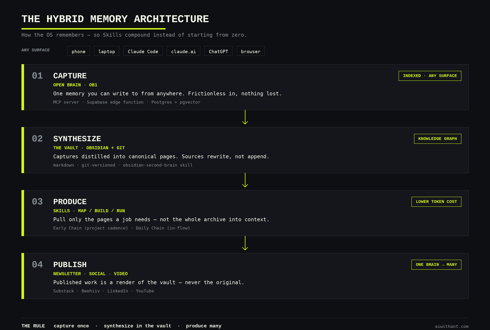

# The Architecture — How the OS Remembers

The hybrid memory system that sits underneath Map / Build / Run.

---

## Why this doc exists

Map / Build / Run tells you how to design the Skills. It doesn't tell you where the system's *memory* lives — and without memory, you don't have an operating system. You have a pile of Skills that forget everything the moment they finish running. That's the vending machine again, just with better prompts.

An OS needs a substrate: one place work gets captured, one place knowledge is true, and a rule that moves information between them. Get that substrate right and every Skill you build compounds on the last one. Get it wrong and you're back to re-explaining your world to the model every Monday.

This is that substrate. It's a **hybrid** of two components that most people try to collapse into one — and the whole argument of this doc is why you shouldn't.

---

## The four layers

| Layer | Job | What I run |
|---|---|---|
| **1. Capture** | Get a thought out of your head from anywhere, instantly | **Open Brain** — a memory service (MCP server on a Supabase edge function) |
| **2. Synthesize** | Turn captures into durable, structured, canonical knowledge | **The vault** — an Obsidian / markdown wiki, version-controlled in git |
| **3. Produce** | Consume capture + vault to do the actual work | **Skills** — the Map / Build / Run chains |
| **4. Publish** | Ship the output where your audience is | Newsletter, social, video — wherever the work lands |

One rule ties the stack together:

> **Capture once. Synthesize in the vault. Produce many.**

---

## Layer 1 — Capture (Open Brain)

**What it is:** a small memory service you can write to from anywhere — phone, laptop, Claude Code, the browser, ChatGPT. Built as an MCP server backed by a Supabase edge function (Postgres + pgvector for search-by-meaning), exposing a handful of tools: capture a thought, search by meaning, list recent, get stats. Because it's a service and not a file, every surface you work on can reach the *same* memory.

I run [**Open Brain (OB1)**](https://github.com/NateBJones-Projects/OB1) for this layer — *"the infrastructure layer for your thinking. One database, one AI gateway, one chat channel — any AI plugs in."* It's self-hosted and open source, so the memory is yours, not a SaaS vendor's.

**Its job:** kill capture friction. The single most expensive failure in personal AI isn't a bad prompt — it's the insight you never wrote down because the place to write it down was three taps and an app-switch away. A capture layer has exactly one requirement: be so fast and so omnipresent that there's no excuse not to use it.

**Why a service, not a file:** capture has to be instant and ambient. You're mid-call, a thought lands, you dump it and move on. You should not have to know *where* it goes, what folder it lives in, or how it's tagged. That's the service's problem, solved later, by synthesis.

---

## Layer 2 — Synthesize (the vault — your LLM wiki)

**What it is:** an Obsidian vault — plain markdown files, version-controlled in git. The source of truth for knowledge, entities, decisions, and strategy. The wiki your LLM reads before it does anything. Captures flow *in*; structured, durable knowledge is what comes *out*.

**Its job:** be canonical. When a Skill needs to know who an account's stakeholders are, what a project decided, or what your positioning is, it reads the vault. Not a chat history, not a capture inbox — the vault. There is one home for each fact.

**How synthesis happens:** distilling captures into structured pages is the work this layer does, and it can be automated. I drive it with the [**obsidian-second-brain**](https://github.com/eugeniughelbur/obsidian-second-brain) Claude Code skill — *"one codebase, four CLIs, same brain."* Its key move: a new source *rewrites* the existing page on a topic instead of appending another note below it. That's what keeps the vault compounding into sharper knowledge rather than sprawling into a pile of clippings — the difference between a second brain and a junk drawer.

**Why files, not a database or an app:**

- **You own them.** Markdown on disk outlives any vendor. No lock-in, no export dance.
- **They're portable.** A vault is just a folder. Put it in a private git repo and it's reachable from any machine — and from Claude Code on the web, which clones the repo into each session. The whole brain travels with a `git clone`.
- **Markdown is the native language of LLMs.** No adapter, no schema mapping. The model reads your knowledge the way it reads everything else.
- **Git gives you history and sync for free.** Every change is versioned; every machine reconciles through the same remote.

---

## Layer 3 — Produce (Skills)

This is where Map / Build / Run lives. The Skills — the Early Chain at project cadence, the Daily Chain in-flow — read the vault for context and Open Brain for what's fresh, then produce the work: briefs, drafts, plans, sequences, images. A Skill is never the keeper of truth; it's a consumer of it. That separation is what lets you rewrite, replace, or delete a Skill without losing a single fact.

---

## Layer 4 — Publish

The output layer — newsletter, social, video, wherever your audience is. Nothing canonical lives here; it's the terminus, not a store. Published work is a *render* of the vault, never the original.

---

## The rule that holds it together

> **Capture once. Synthesize in the vault. Produce many.**

- **Capture once** — a thought enters the system through Open Brain, from whatever surface you're on, and you never think about it again until synthesis.
- **Synthesize in the vault** — captures get distilled into the vault, where they become structured, linked, canonical knowledge.
- **Produce many** — Skills draw on that one canonical brain to generate as much work as you want, in as many formats as you want.

And the tiebreaker, for when two layers seem to "own" the same fact: **Open Brain feeds the vault; it never wins an ownership dispute.** The vault is canonical for knowledge and strategy. The production config is canonical for how work gets made. One fact, one home.

---

## Why hybrid? (the part most people get wrong)

The instinct is to pick one tool and make it do everything. Don't. Capture and knowledge have *opposite* requirements:

| | Capture wants | Knowledge wants |
|---|---|---|
| Speed | Instant | Can be slow |
| Structure | None — just dump it | Highly structured |
| Reach | Everywhere, every surface | One canonical location |
| Lifespan | Ephemeral until synthesized | Durable, owned, versioned |
| Feel | A fast inbox | A slow library |

A single tool optimized for one of these columns is bad at the other. A capture app that forces you to file and tag in the moment isn't fast — so you stop using it, and the insights evaporate. A knowledge base you can only edit from one machine in one app isn't ambient — so the captures never make it in.

So you split them. A fast inbox (Open Brain) and a slow library (the vault), connected by the rule. That's the hybrid, and it's the whole point.

---

## What the hybrid buys you

The split isn't just tidy — it pays for itself in four ways that a single chat-window workflow can't touch.

**Lower token cost.** This is the one people feel in the bill. Without a vault, every task starts by dumping context into the prompt — whole transcripts, whole documents, "here's everything about this account again." With a vault, a Skill retrieves *only the pages it needs* and Open Brain returns *only the semantic matches*, so you pay for the paragraph, not the archive. Persistent memory also means you stop re-explaining your world every session. Retrieval beats brute-force context, and retrieval is cheaper.

**Indexed memory.** Open Brain stores captures with vector embeddings (pgvector), so recall is *search by meaning*, not search by keyword or by remembering where you filed it. Ask for "that thing about renewal risk" and you get it, even if you never used those words when you captured it.

**A knowledge graph.** The vault isn't a flat folder of notes — Obsidian links entities, decisions, projects, and people into a graph. The model can traverse relationships ("who are the stakeholders on this account, and what did we decide last quarter?") instead of scanning a list. Synthesis keeps the graph dense: because new sources *rewrite* the page on a topic instead of appending another note, the graph sharpens over time rather than silting up with duplicates.

**Flexible data collection → synthesis.** Collection stays loose and opportunistic — clip research, dictate a thought, paste a link, from any surface, with zero up-front structure. Synthesis is where structure gets imposed, on its own schedule: captures and sources get distilled and merged into canonical vault pages. Loose in, structured out. You never have to choose between "capture it now" and "file it correctly" — the architecture lets you do both, in that order.

---

## Why this makes the system cross-surface

Because capture is a *service* and knowledge is *git*, the entire OS is reachable from anywhere:

- **Open Brain** is an MCP server — it connects to Claude Code, Claude Desktop, claude.ai, and ChatGPT alike. Same memory, every surface.
- **The vault** is a git repo — clone it on a second machine, or point a Claude Code web session at it, and the full knowledge base is right there.

Machine independence isn't a bonus feature bolted on later. It falls out of the architecture: a service you can call from anywhere, plus files you can clone anywhere. Nothing is trapped on one laptop.

---

## The components

| Component | Role | Notes |
|---|---|---|
| **[`ai-with-ant-os`](./README.md)** (this repo) | The method + reference architecture | Public, MIT. The blueprint. |
| **[Open Brain (OB1)](https://github.com/NateBJones-Projects/OB1)** | Capture layer | Self-hosted MCP server on a Supabase edge function (Postgres + pgvector). The cross-surface memory. Built by Nate B. Jones. |
| **[obsidian-second-brain](https://github.com/eugeniughelbur/obsidian-second-brain)** | Synthesize engine | Claude Code skill that turns the vault into a self-updating wiki — sources rewrite pages instead of appending. Built by Eugeniu Ghelbur. |
| **Your vault** | Synthesize layer | A private git repo of markdown — the canonical knowledge. **Keep it private**; it's your entities, decisions, and strategy. |
| **Skills / production config** | Produce layer | The Map / Build / Run chains that consume the brain. |
| **Printing Press** (`printingpress.dev`) | Tooling | Generates the CLIs that wire APIs into the system. |

---

## How to build your own

1. **Stand up a capture layer.** Anything you can write to from every surface you use. An MCP-backed service like [Open Brain (OB1)](https://github.com/NateBJones-Projects/OB1) is the clean version; even a single always-open note works to start. The only hard requirement: zero friction, everywhere.
2. **Start a vault.** A folder of markdown, in a private git repo. This is your source of truth. Push it to a remote so it's reachable from any machine and from Claude Code on the web. To automate the synthesis step, the [obsidian-second-brain](https://github.com/eugeniughelbur/obsidian-second-brain) skill is a strong starting point.
3. **Wire the rule.** Capture once → synthesize into the vault → produce many. Decide, up front, that the vault is canonical and capture only feeds it. One fact, one home.
4. **Build Skills on top.** Now apply [Map / Build / Run](./METHOD.md). Every Skill reads the brain and writes its output downstream — never the other way around.

The components are swappable. The *shape* — fast capture, canonical vault, the rule between them, Skills on top — is the part that matters.

---

## Next

- [`METHOD.md`](./METHOD.md) — Map / Build / Run, the Skill-design framework that runs on this substrate
- [`prompts/slack-skill-builder.md`](./prompts/slack-skill-builder.md) — spec a Skill for the Produce layer
- [AI with Ant — Field Notes](https://aiwithant.com) — applied build logs and teardowns

— Anthony Brown
